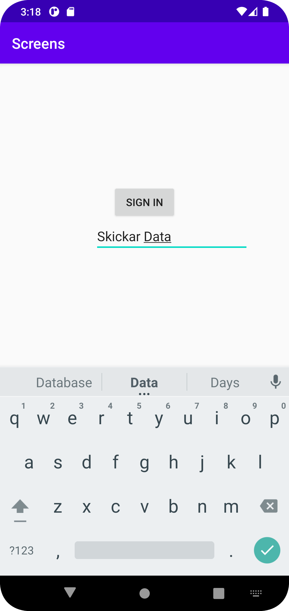
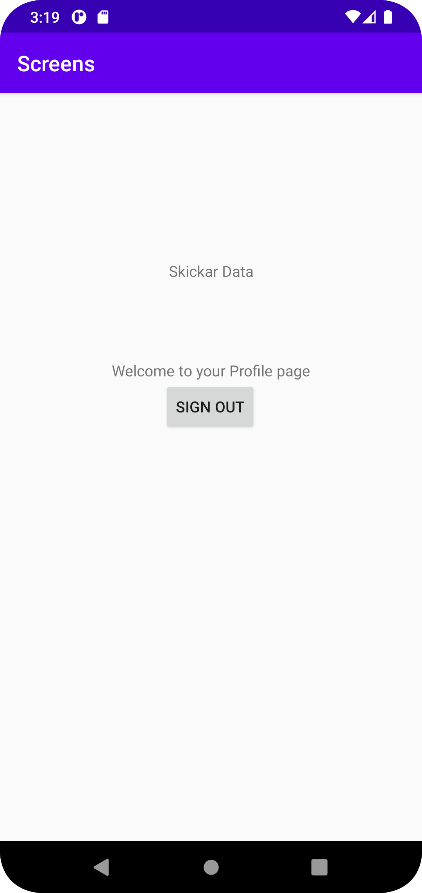

# Rapport

**Skriv din rapport här!**

Började med att skapa en second activity. (screen2.java filen)

Därefter skapade jag en button i båda layouts filerna för att senare kunna logga in och ut. 


///
<Button
android:id="@+id/sign_in_button"
android:layout_width="wrap_content"
android:layout_height="wrap_content"
android:text="Sign in"
app:layout_constraintBottom_toTopOf="@+id/login_text"
app:layout_constraintEnd_toEndOf="parent"
app:layout_constraintStart_toStartOf="parent"
/>

///

Jag skapade sedan möjligheten att skicka data mellan de två filerna med intents och extras bundles 
i mainactivity samt screen2 filerna. Detta för att dessa filer ska kunna skicka data mellan 
varandra. 


///@Override
public void onClick(View view) {
Log.d("==>", "MainActivity Sign in button Pressed.");
Log.d("==>", "Username"+username.getText().toString());
Intent intent = new Intent(MainActivity.this, screen2.class);


                intent.putExtra("username",username.getText().toString());
                startActivity(intent);
                intent.putExtra("username",username.getText().toString());
                startActivity(intent);
            }
        });
///
Koden ovanför är för mainActivity.java och detta är det som skapar möjligheten att skicka en string
data över till screen2 filen. 
///
@Override
protected void onCreate(Bundle savedInstanceState) {
super.onCreate(savedInstanceState);
setContentView(R.layout.activity_screen2);

        signout = findViewById(R.id.sign_out_button);
        usernameView = findViewById(R.id.username_text);

        Intent intent = getIntent();
        Bundle extras = intent.getExtras();
        String username = extras.getString("username");

///
Koden ovanför är det som skapar möjligheten ta emot data från MainActivity.java filen. 

Lade sedan till en edit text (plaintext) för att "användaren" ska kunna skriva in ett användarnamn 
exempelvis som sedan visas på andra filen vid inloggning. 


EXEMPEL BILDER FRÅN APPEN




## Följande grundsyn gäller dugga-svar:

- Ett kortfattat svar är att föredra. Svar som är längre än en sida text (skärmdumpar och programkod exkluderat) är onödigt långt.
- Svaret skall ha minst en snutt programkod.
- Svaret skall inkludera en kort övergripande förklarande text som redogör för vad respektive snutt programkod gör eller som svarar på annan teorifråga.
- Svaret skall ha minst en skärmdump. Skärmdumpar skall illustrera exekvering av relevant programkod. Eventuell text i skärmdumpar måste vara läsbar.
- I de fall detta efterfrågas, dela upp delar av ditt svar i för- och nackdelar. Dina för- respektive nackdelar skall vara i form av punktlistor med kortare stycken (3-4 meningar).

Programkod ska se ut som exemplet nedan. Koden måste vara korrekt indenterad då den blir lättare att läsa vilket gör det lättare att hitta syntaktiska fel.

```
function errorCallback(error) {
    switch(error.code) {
        case error.PERMISSION_DENIED:
            // Geolocation API stöds inte, gör något
            break;
        case error.POSITION_UNAVAILABLE:
            // Misslyckat positionsanrop, gör något
            break;
        case error.UNKNOWN_ERROR:
            // Okänt fel, gör något
            break;
    }
}
```

Bilder läggs i samma mapp som markdown-filen.


Läs gärna:

- Boulos, M.N.K., Warren, J., Gong, J. & Yue, P. (2010) Web GIS in practice VIII: HTML5 and the canvas element for interactive online mapping. International journal of health geographics 9, 14. Shin, Y. &
- Wunsche, B.C. (2013) A smartphone-based golf simulation exercise game for supporting arthritis patients. 2013 28th International Conference of Image and Vision Computing New Zealand (IVCNZ), IEEE, pp. 459–464.
- Wohlin, C., Runeson, P., Höst, M., Ohlsson, M.C., Regnell, B., Wesslén, A. (2012) Experimentation in Software Engineering, Berlin, Heidelberg: Springer Berlin Heidelberg.
